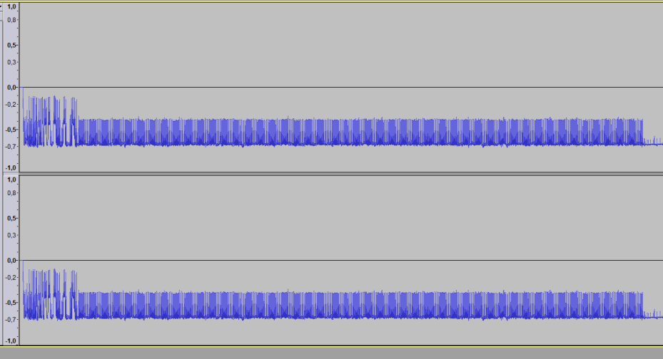
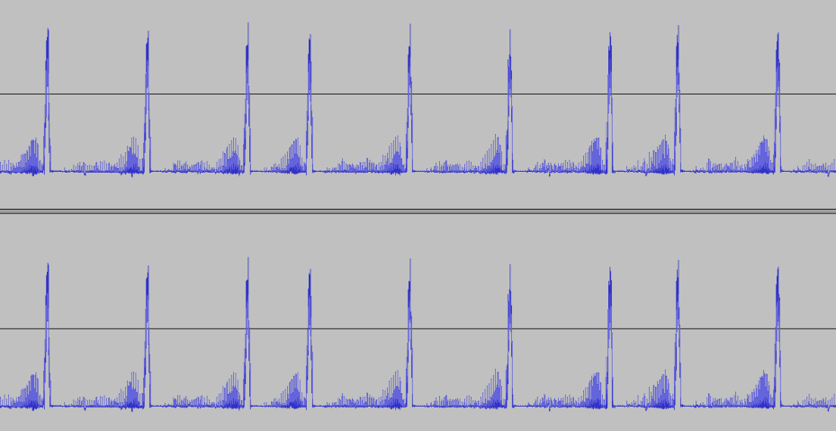
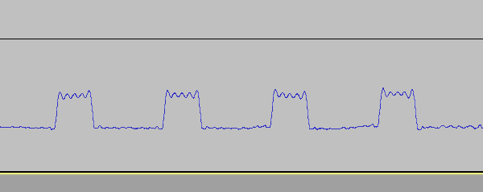

# FOLD

♐FOLD is a video posted to the second youtube account on December 4,
2016.

{{\#ev:youtube|<https://www.youtube.com/watch?v=QMYIz1CJmvo>}} [Original Link](https://youtu.be/C2a46R3xjVQ)

## Description of video

The video is 37 seconds in length. The visuals contain a series of
flashing frames.

## Audio analysis

Discord user ShadowMorphyn has noted the audio is "like a printer modem
hybrid plus its '[handshake](Handshake "wikilink")'". Also: "there are
16 blips in the audio... pattern wise it kind of looks like this:
"11111-111-111111" where 1 is blips that are rhythmic in sound and -
where it stutters a bit. It's like 5 3 6. A pattern but it could mean
anything or nothing at all. \[...\] those blips might be binary. I
switched out the - for a 0 and got this: 1111101110111111, which
translates to \[Unicode\] 251 and 191 \[or\] Û¿ basically."

Discord user Risto notes that "♐FOLD is another one with [DC offset](DC_offset "wikilink")":

He also observes that ♐FOLD "starts with about a half of a handshake":

And that "And ends with the third quarter of it.":

Ristro also observes: "As for the audio itself, there is a section of
something like electrical noise":

"The frequency of that is 120 Hz. Then there's a section of ramping up
pulses of that electrical noise":

"The electric noise is an approximation of a square wave":

"The last section is a different noise that seems to cycle once in about
2 seconds":

## Significance of name

[Fold (higher-order function)](https://en.wikipedia.org/wiki/Fold_\(higher-order_function\)):
"In functional programming, fold (also termed reduce, accumulate,
aggregate, compress, or inject) refers to a family of higher-order
functions that analyze a recursive data structure and through use of a
given combining operation, recombine the results of recursively
processing its constituent parts, building up a return value. Typically,
a fold is presented with a combining function, a top node of a data
structure, and possibly some default values to be used under certain
conditions. The fold then proceeds to combine elements of the data
structure's hierarchy, using the function in a systematic way."

## Relationship to other UFSC videos

  - A *fold* is conceptually related to a [ *crimp*](CRIMP "wikilink").
  - FOLD is alphabetically close to [FOND](FOND "wikilink").

## Composites

*♐FOLD composite by ShadowMorphyn*

