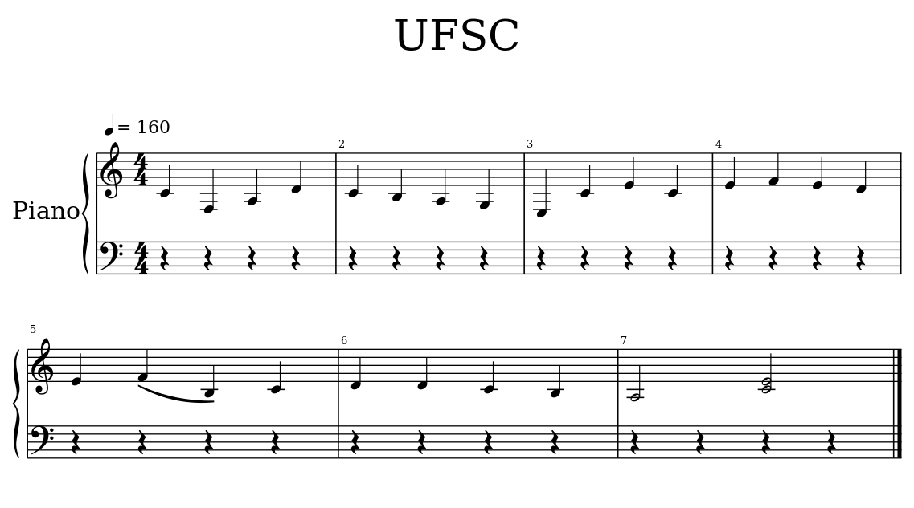
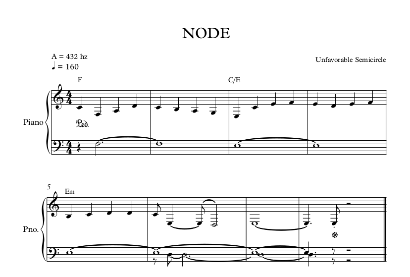
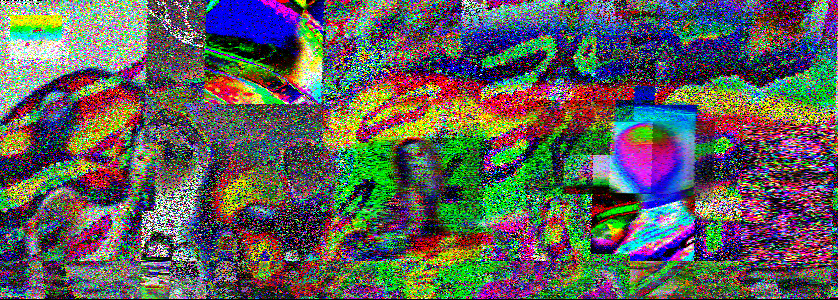
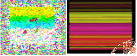

♐NODE is a video posted to the [3rd youtube channel](3rd_youtube_channel "wikilink") account on January 22, 2018. It
is 2:19:20 long and contains a series of moving images. It was posted 18
days after ♐[RUN](RUN "wikilink"). ♐[SERN](SERN "wikilink") would be
posted four days later.

{{\#ev:youtube|<https://youtu.be/CCPFWvziyCc>}}

## Audio

The audio track is mostly silent, except for 5 sound-bursts:

  - a "subway brake squeal" (similar to ♐[LIMIT](LIMIT "wikilink")) at
    8:04
  - a similar sound to the first at 20:40
  - a high-pitched (pitch-shifted?) noise that could be a modified
    version of the above sounds at 23:28
  - a 34-second crunchy noise at 58:49 (with what sounds like a shorter
    sound hidden under the noise)
  - an 11-second melodic burst (distorted piano or some sort of
    keyboard?) at 2:16:59

Those sounds, with the silence between them removed can be heard
[here](https://clyp.it/0g5p0e31).

### The "Melody"

The final audio section has a clear melody and is the subject of
continued investigation.

(*audio transcription by discord user A Hidden Waffle — listenable
[here](https://flat.io/score/5a6a5602403e3b06e6ab05ee-ufsc)*)

Discord user alexander later provided a more elaborate transcription of
the melody:

alexander has also confirmed that "the melody is written in the 432hz
tuning."

  - 432hz is considered significant in certain musical/mystical
    communities. See
    \[<https://motherboard.vice.com/en_us/article/xywy74/the-fringe-audiophiles-who-want-to-topple-standard-tuning>|
    here\] (or \[<https://attunedvibrations.com/432hz/>| here\] for a
    less skeptical take).

### Similarities to "the Windowlicker"

It has been noted by Discord user scottywiththebody that the "subway
brake squeal" bares some striking resemblance to the screeching limo in
Aphex Twin's "the Windowlicker" music video. Discord user Ryallin
further noted that the crunchy noise also bares some resemblance to the
mechanical groans of the limo. Noises start at 3:50.

{{\#ev:youtube|<https://youtu.be/UBS4Gi1y_nc?t=3m46s>}}

alexander's later analysis concurs that "it is 100% a blatant sample of
windowlicker".

### Additional Analysis

Discord user alexbassguy notes that the audio "contains a few distorted
passages of synthesizer. However, the nature of the distortion isn't the
same as 'old' ufsc. It's just clipped really badly, not... altered, in
that beautiful real UFSC way that I've always been fascinated by. I can
also easily recreate those artifacts pretty quickly and simply."

## Title

*please elaborate*

## Composites

### 2-D Composite

(*composite by discord user extra*)

It has been noted by Discord user Raketemensch that there are visual
similarities between this composite and
[certain](https://images-ext-1.discordapp.net/external/oXuES9EQAqW9SbhJx7I_x3acEkV9KtexYDt7ZMf1uYs/https/upload.wikimedia.org/wikipedia/commons/b/b4/Vassily_Kandinsky%2C_1913_-_Composition_7.jpg?width=400&height=263)
[paintings](https://images-ext-2.discordapp.net/external/JP7-xXaR7HCjPEnh1CS6Vr1FFfgIrMA8jZVKyDxcBZQ/http/www.wassilykandinsky.net/images/works/205.jpg?width=341&height=301)
by [Wassily Kandinsky](https://en.wikipedia.org/wiki/Wassily_Kandinsky).

#### Details in composite

  - As with other recent composites, there are a series of black/white
    dots in the top corner of the ♐NODE composite.

*This has been the subject of further research — see "morse code"
section below.*

  - Similar to ♐[HARVEST](HARVEST "wikilink"), there is a "flag"/striped
    banner image in the top left corner of the image.

(*"flag" from ♐NODE on the left, "flag" (a.k.a. "the lasagne") from
♐HARVEST on the right*)

It's possible that these were meant for vertical calibration when
selecting composite widths.

### 3-D Composite

(*composite by discord user tukkek*)

  - there are no immediately-discernible patterns in this "not terribly
    interesting" 3-D composite.

## "Morse code"

Discord user NKC1982 performed analysis of the "Morse code" in the top
left of the composite. Their method and conclusions:

  - There's definitely some meaning in the "Morse Code" section, because
    it can be decoded to 7-bit ASCII. And if one assumes it's OK for
    there to be a 1-bit error, it even spells something.
  - The sets of symbols (disregarding the grey ones and using only the
    white and black) are each 9 to 10 pixels across, so it seemed likely
    to be some kind of 7 or 8 bit code with parity or timing marks. I
    also noticed each group started with a black pixel, so I initially
    took that as a "start bit" like in serial/RS-232 communication
  - I got "11001000 11000101 11011100 11110000 11110011 11101111
    11001110 11000111 " \[which is\] not ASCII. I then realized they ALL
    started with a 1, so in fact each was starting with a
    black-then-white PAIR. A-Ha\!
  - Removing the leading 1, this gave me 7 bit ASCII which decoded to
    "1001000 1000101 1011100 1110000 1110011 1101111 1001110 1000111"
    which decodes to "HE\\psoNG". Assuming a small encoding error,
    changing just the 5th bit of the 3rd byte gives you "HELpsoNG".
  - NODE contains "the melody" so maybe the binary message is meant to
    say "HELP SONG" and is trying to lead us somewhere. Food for thought
    at least.

(*see also NKC1982's observations for ♐[RUN](RUN "wikilink").*)
